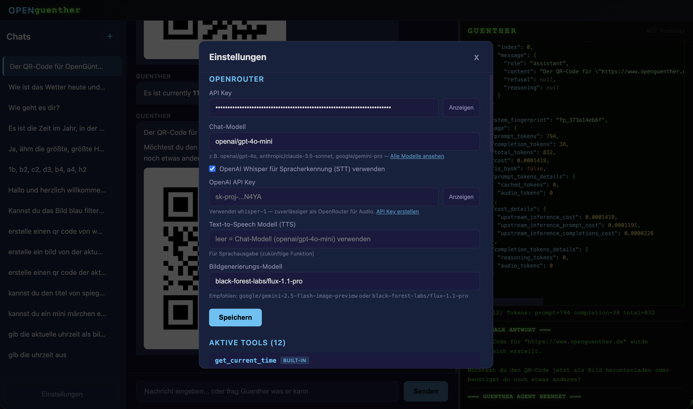
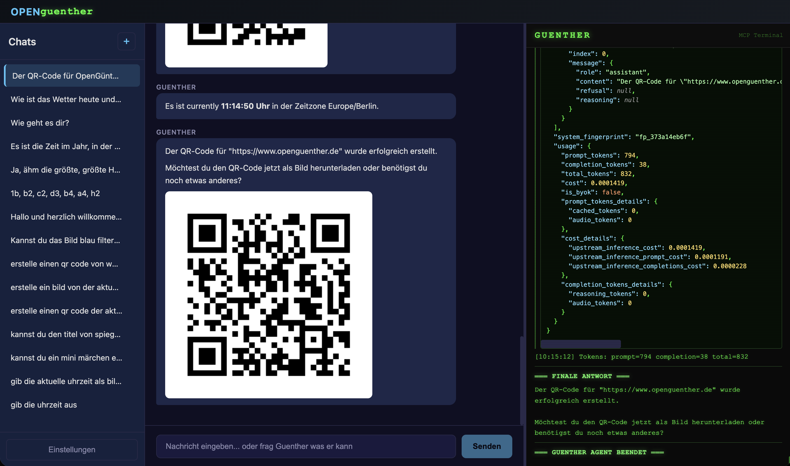
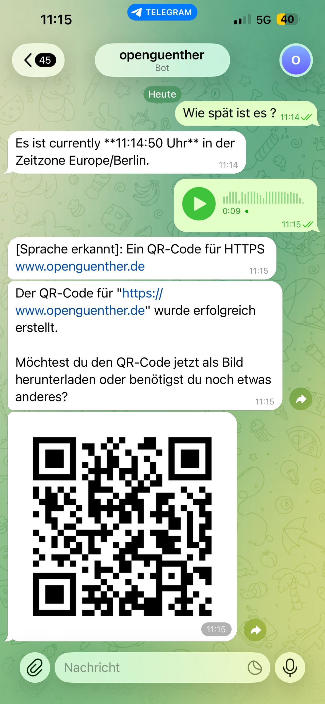

# OPENguenther

**🌐 [openguenther.de](https://www.openguenther.de)**


---

## Inhaltsverzeichnis / Table of Contents

- 🇩🇪 [Deutsch](#-deutsch)
  - [Features](#features)
  - [Tech-Stack](#tech-stack)
  - [Installation auf einem Hetzner VPS](#installation-auf-einem-hetzner-vps-schritt-für-schritt-für-einsteiger)
  - [Schnellstart](#schnellstart-für-erfahrene)
  - [Konfiguration](#konfiguration)
  - [Built-in Tools](#built-in-tools)
  - [Disclaimer / Haftungsausschluss](#disclaimer--haftungsausschluss)
- 🇬🇧 [English](#-english)
  - [Features](#features-1)
  - [Tech Stack](#tech-stack-1)
  - [Installation on a Hetzner VPS](#installation-on-a-hetzner-vps-step-by-step-for-beginners)
  - [Quick Start](#quick-start-for-experienced-users)
  - [Configuration](#configuration)
  - [Built-in Tools](#built-in-tools-1)
  - [Disclaimer](#disclaimer)
- [Screenshots](#screenshots)
- [License](#license)

---

## 🇩🇪 Deutsch

> ⚠️ **Die Nutzung dieser Software geschieht vollständig auf eigenes Risiko. Die alleinige Verantwortung liegt beim Nutzer. Der Autor übernimmt keinerlei Haftung.** Siehe [Disclaimer](#disclaimer--haftungsausschluss) unten.

Ein selbst gehosteter KI-Agent mit Chat-Interface, MCP-Tool-Unterstützung und Telegram-Integration.

---

### Features

- **Chat-Interface** mit Markdown-Rendering und Bilddarstellung
- **MCP-Tools** (Model Context Protocol): Wetter, Bildgenerierung, Bildbearbeitung, QR-Codes, Passwörter, Rechner, E-Mail, Webseiten-Info u.v.m.
- **Guenther-Terminal**: Live-Ansicht aller API-Kommunikation im DOS-Stil
- **Telegram-Gateway**: Chatten via Telegram, inkl. Foto- und Sprachnachrichten
- **Spracherkennung**: OpenAI Whisper oder OpenRouter-kompatible Modelle
- **Bildgenerierung**: via OpenRouter (Flux, Gemini Image, etc.)
- **Externe MCP-Server**: beliebige stdio-basierte MCP-Server anbindbar
- **Tool-Router**: automatische Vorauswahl relevanter Tools pro Anfrage
- **Light/Dark Theme**: umschaltbar per Button in der Titelleiste, Auswahl wird gespeichert
- **Kopieren-Button**: Jede Nachricht hat ein Kopieren-Icon (Zwischenablage)
- **Live Tool-Anzeige**: Während Guenther denkt, wird das aktive Tool + Log-Status neben den Punkten angezeigt
- **SSH-Tunnel-Guide**: Anleitung in Provider-Einstellungen für Ollama/LM Studio (Reverse-Tunnel vom Heimrechner zum Server)

---

### Tech-Stack

- **Backend**: Flask 3, Flask-SocketIO, SQLite, Python 3.12
- **Frontend**: React 18, Vite 6, Socket.IO-Client
- **Container**: Docker (Multi-Stage Build)
- **LLM**: OpenRouter API (beliebiges Modell wählbar)

---

### Installation auf einem Hetzner VPS (Schritt-für-Schritt für Einsteiger)

Diese Anleitung zeigt, wie du OPENguenther auf einem günstigen virtuellen Server bei Hetzner zum Laufen bringst. Du brauchst keine Linux-Vorkenntnisse — alles wird erklärt.

#### Schritt 1 — Hetzner-Account und Server erstellen

1. Registriere dich unter **[hetzner.com/cloud](https://www.hetzner.com/cloud)**
2. Erstelle ein neues Projekt (z.B. „openguenther")
3. Klicke auf **„Server hinzufügen"** und wähle:
   - **Standort**: Frankfurt oder Nürnberg
   - **Image**: Debian 12
   - **Typ**: CX22 (2 vCPU, 4 GB RAM) reicht völlig — ca. 4 €/Monat
   - **SSH-Key**: Füge deinen öffentlichen SSH-Key ein (empfohlen) **oder** aktiviere die Root-Passwort-Option
4. Klicke auf **„Server erstellen"** — nach wenigen Sekunden hat der Server eine IP-Adresse (z.B. `123.456.789.0`)

> 💡 **SSH-Key erstellen** (falls du noch keinen hast): Auf dem Mac/Linux öffne ein Terminal und tippe `ssh-keygen -t ed25519`. Den Inhalt der Datei `~/.ssh/id_ed25519.pub` fügst du bei Hetzner ein.

#### Schritt 2 — Mit dem Server verbinden

Öffne ein Terminal (Mac: Programme → Terminal, Windows: PowerShell oder [PuTTY](https://putty.org)) und verbinde dich:

```bash
ssh root@123.456.789.0
```

Ersetze `123.456.789.0` mit der IP-Adresse deines Servers. Beim ersten Verbinden erscheint eine Sicherheitsfrage — tippe `yes` und drücke Enter.

#### Schritt 3 — System aktualisieren

```bash
apt update && apt upgrade -y
```

Das aktualisiert alle vorinstallierten Programme. Kann 1–2 Minuten dauern.

#### Schritt 4 — Docker installieren

Docker ist das System, das OPENguenther in einer isolierten Umgebung ausführt. Installiere es mit:

```bash
apt install -y docker.io
```

Überprüfe ob Docker läuft:

```bash
docker --version
```

Es sollte etwas wie `Docker version 20.x.x` erscheinen.

#### Schritt 5 — Git installieren und Code herunterladen

```bash
apt install -y git
git clone https://github.com/ghaslbe/openguenther.git
cd openguenther
```

#### Schritt 6 — Docker-Image bauen

```bash
docker build -t openguenther .
```

Du siehst viele Zeilen — das ist normal. Wenn am Ende `Successfully tagged openguenther:latest` erscheint, hat es geklappt. Dauert beim ersten Mal 3–5 Minuten.

#### Schritt 7 — OPENguenther starten

```bash
docker run -d \
  --name openguenther \
  -p 3333:5000 \
  -v openguenther-data:/app/data \
  --restart unless-stopped \
  openguenther
```

Überprüfe ob es läuft:

```bash
docker logs openguenther
```

Du solltest `Running on all addresses (0.0.0.0)` sehen.

#### Schritt 8 — Im Browser öffnen

```
http://123.456.789.0:3333
```

Du solltest jetzt das OPENguenther-Interface sehen! 🎉

#### Schritt 9 — OpenRouter API Key einrichten

1. Registriere dich kostenlos unter **[openrouter.ai](https://openrouter.ai)**
2. Gehe zu **Keys** → **Create Key**
3. Kopiere den Key (beginnt mit `sk-or-v1-...`)
4. In OPENguenther: Klicke auf das **Zahnrad-Icon** (⚙️) oben links
5. Füge den Key bei **„API Key"** ein und klicke **Speichern**
6. Wähle ein Modell, z.B. `openai/gpt-4o-mini` (günstig) oder `google/gemini-2.0-flash-001` (schnell)

> 💡 **Tipp**: Bei OpenRouter kannst du ein Ausgaben-Limit setzen, damit keine unerwarteten Kosten entstehen.

#### Schritt 10 — Fertig!

Probiere zum Beispiel:
- *„Wie ist das Wetter in Berlin?"*
- *„Generiere ein Passwort mit 20 Zeichen"*
- *„Erstelle einen QR-Code für https://example.com"*

#### Optionale Schritte

**Firewall einrichten (empfohlen)**

```bash
apt install -y ufw
ufw allow ssh
ufw allow 3333
ufw enable
```

**OPENguenther aktualisieren**

Im Projektordner einfach das Update-Script ausführen:

```bash
cd openguenther
bash update.sh
```

Das Script holt automatisch den neuesten Code von GitHub, baut das Docker-Image neu und startet den Container. Deine Chats und Einstellungen bleiben erhalten (Docker-Volume `openguenther-data`).

**Telegram-Bot einrichten**

1. Schreibe in Telegram mit **[@BotFather](https://t.me/BotFather)**: `/newbot`
2. Folge den Anweisungen und kopiere den Bot-Token
3. In OPENguenther-Einstellungen: Token eintragen, Telegram-Username in die Whitelist und auf **„Gateway starten"** klicken

---

### Schnellstart (für Erfahrene)

```bash
git clone https://github.com/ghaslbe/openguenther.git && cd openguenther
docker build -t openguenther .
docker run -d --name openguenther -p 3333:5000 -v openguenther-data:/app/data --restart unless-stopped openguenther
```

Aufruf: `http://localhost:3333` — API Key in den Einstellungen eintragen.

---

### Konfiguration

Alle Einstellungen werden über das Web-Interface vorgenommen (Zahnrad-Icon ⚙️):

- **OpenRouter API Key** + Modell
- **Telegram Bot Token** + erlaubte Nutzer
- **OpenAI API Key** (optional, für Whisper Spracherkennung)
- **Bildgenerierungs-Modell** (optional, z.B. `black-forest-labs/flux-1.1-pro`)
- **STT-Modell** (optional, z.B. `google/gemini-2.5-flash`)

Daten werden persistent in einem Docker-Volume gespeichert (`/app/data`).

---

### Built-in Tools

| Tool | Beschreibung |
|------|-------------|
| `get_stock_price` | Aktienkurs, Tagesveränderung, Kennzahlen via Yahoo Finance (kein API-Key) |
| `resolve_callsign` | Flugzeug-Rufzeichen auflösen: Airline-Name via OpenFlights + Live-Daten via adsb.one (kein API-Key) |
| `geocode_location` | Geokoordinaten für PLZ, Ortsnamen oder Adressen via OpenStreetMap Nominatim (kein API-Key) |
| `get_flights_nearby` | Live-Flugzeuge in der Nähe von Koordinaten via OpenSky Network ADS-B (kein API-Key) |
| `get_weather` | Wetter & Vorhersage via Open-Meteo (kein API-Key) |
| `generate_image` | Bildgenerierung via OpenRouter |
| `process_image` | Bildbearbeitung via ImageMagick (blur, grayscale, rotate, …) |
| `text_to_image` | Text als PNG rendern |
| `generate_qr_code` | QR-Code generieren |
| `fetch_website_info` | Website-Titel & Description abrufen |
| `send_email` | E-Mail via SMTP senden |
| `generate_password` | Sichere Passwörter generieren |
| `calculate` | Mathematische Ausdrücke auswerten |
| `roll_dice` | Würfeln |
| `get_current_time` | Aktuelle Uhrzeit |

---

### Disclaimer / Haftungsausschluss

> ⚠️ **DIE NUTZUNG DIESER SOFTWARE GESCHIEHT VOLLSTÄNDIG AUF EIGENES RISIKO. DIE ALLEINIGE VERANTWORTUNG FÜR DIE NUTZUNG LIEGT BEIM NUTZER.**

Diese Software wird **„wie besehen"** (as-is) ohne jegliche ausdrückliche oder stillschweigende Gewährleistung bereitgestellt. Der Autor übernimmt **keinerlei Haftung** für direkte, indirekte, zufällige, besondere oder Folgeschäden, die aus der Nutzung oder Nichtnutzung dieser Software entstehen – gleichgültig, ob diese auf Vertrag, unerlaubter Handlung oder einem anderen Rechtsgrund beruhen.

**Die gesamte Verantwortung für den Betrieb, die Konfiguration und die Nutzung dieser Software – einschließlich aller daraus resultierenden Handlungen und Konsequenzen – liegt ausschließlich beim Nutzer.**

Dies umfasst insbesondere, aber nicht ausschließlich:

- Schäden durch KI-generierte Inhalte
- Kosten durch API-Nutzung bei Drittanbietern (OpenRouter, OpenAI, etc.)
- Datenverlust oder Sicherheitsvorfälle
- Schäden durch fehlerhafte Tool-Ausführungen
- Rechtliche Konsequenzen aus der Nutzung oder den durch die Software ausgeführten Aktionen

**Der Autor empfiehlt ausdrücklich:**
- API-Keys mit minimalen Berechtigungen und Ausgabelimits zu versehen
- Die Software nicht ohne Authentifizierung öffentlich zugänglich zu machen
- Keine sensiblen Daten in Chats einzugeben

---

## 🇬🇧 English

> ⚠️ **Use of this software is entirely at your own risk. Sole responsibility rests with the user. The author accepts no liability whatsoever.** See [Disclaimer](#disclaimer) below.

A self-hosted AI agent with chat interface, MCP tool support and Telegram integration.

---

### Features

- **Chat interface** with Markdown rendering and image display
- **MCP Tools** (Model Context Protocol): weather, image generation, image editing, QR codes, passwords, calculator, email, website info and more
- **Guenther Terminal**: live view of all API communication in DOS style
- **Telegram Gateway**: chat via Telegram, including photos and voice messages
- **Speech recognition**: OpenAI Whisper or OpenRouter-compatible models
- **Image generation**: via OpenRouter (Flux, Gemini Image, etc.)
- **External MCP servers**: connect any stdio-based MCP server
- **Tool router**: automatic pre-selection of relevant tools per request
- **Light/Dark Theme**: toggle via button in the title bar, preference is saved
- **Copy button**: every message has a copy icon (clipboard)
- **Live tool display**: while Guenther is thinking, the active tool + log status is shown next to the typing dots
- **SSH tunnel guide**: instructions in provider settings for Ollama/LM Studio (reverse tunnel from home machine to server)

---

### Tech Stack

- **Backend**: Flask 3, Flask-SocketIO, SQLite, Python 3.12
- **Frontend**: React 18, Vite 6, Socket.IO-Client
- **Container**: Docker (Multi-Stage Build)
- **LLM**: OpenRouter API (any model selectable)

---

### Installation on a Hetzner VPS (Step-by-Step for Beginners)

This guide shows how to get OPENguenther running on an affordable virtual server at Hetzner. No Linux knowledge required — everything is explained.

#### Step 1 — Create a Hetzner account and server

1. Register at **[hetzner.com/cloud](https://www.hetzner.com/cloud)**
2. Create a new project (e.g. "openguenther")
3. Click **"Add Server"** and choose:
   - **Location**: Frankfurt or Nuremberg
   - **Image**: Debian 12
   - **Type**: CX22 (2 vCPU, 4 GB RAM) is sufficient — approx. €4/month
   - **SSH Key**: paste your public SSH key (recommended) **or** enable the root password option
4. Click **"Create Server"** — within a few seconds the server will have an IP address (e.g. `123.456.789.0`)

> 💡 **Create an SSH key** (if you don't have one yet): On Mac/Linux open a terminal and type `ssh-keygen -t ed25519`. Paste the contents of `~/.ssh/id_ed25519.pub` into Hetzner.

#### Step 2 — Connect to the server

Open a terminal (Mac: Applications → Terminal, Windows: PowerShell or [PuTTY](https://putty.org)) and connect:

```bash
ssh root@123.456.789.0
```

Replace `123.456.789.0` with your server's IP address. On first connection a security prompt appears — type `yes` and press Enter.

#### Step 3 — Update the system

```bash
apt update && apt upgrade -y
```

This updates all pre-installed packages. May take 1–2 minutes.

#### Step 4 — Install Docker

Docker runs OPENguenther in an isolated environment. Install it with:

```bash
apt install -y docker.io
```

Verify Docker is running:

```bash
docker --version
```

You should see something like `Docker version 20.x.x`.

#### Step 5 — Install Git and download the code

```bash
apt install -y git
git clone https://github.com/ghaslbe/openguenther.git
cd openguenther
```

#### Step 6 — Build the Docker image

```bash
docker build -t openguenther .
```

You will see many lines — that is normal. When `Successfully tagged openguenther:latest` appears at the end, it worked. Takes 3–5 minutes the first time.

#### Step 7 — Start OPENguenther

```bash
docker run -d \
  --name openguenther \
  -p 3333:5000 \
  -v openguenther-data:/app/data \
  --restart unless-stopped \
  openguenther
```

Check that it is running:

```bash
docker logs openguenther
```

You should see `Running on all addresses (0.0.0.0)`.

#### Step 8 — Open in the browser

```
http://123.456.789.0:3333
```

You should now see the OPENguenther interface! 🎉

#### Step 9 — Set up the OpenRouter API key

1. Register for free at **[openrouter.ai](https://openrouter.ai)**
2. Go to **Keys** → **Create Key**
3. Copy the key (starts with `sk-or-v1-...`)
4. In OPENguenther: click the **gear icon** (⚙️) in the top left
5. Paste the key in the **"API Key"** field and click **Save**
6. Choose a model, e.g. `openai/gpt-4o-mini` (affordable) or `google/gemini-2.0-flash-001` (fast)

> 💡 **Tip**: In OpenRouter you can set a spending limit to avoid unexpected costs.

#### Step 10 — Done!

Try for example:
- *"What is the weather in Berlin?"*
- *"Generate a password with 20 characters"*
- *"Create a QR code for https://example.com"*

#### Optional steps

**Set up a firewall (recommended)**

```bash
apt install -y ufw
ufw allow ssh
ufw allow 3333
ufw enable
```

**Update OPENguenther**

Simply run the update script from the project folder:

```bash
cd openguenther
bash update.sh
```

The script automatically pulls the latest code from GitHub, rebuilds the Docker image and restarts the container. Your chats and settings are preserved (Docker volume `openguenther-data`).

**Set up a Telegram bot**

1. Message **[@BotFather](https://t.me/BotFather)** on Telegram: `/newbot`
2. Follow the instructions and copy the bot token
3. In OPENguenther settings: enter the token, add your Telegram username to the whitelist and click **"Start Gateway"**

---

### Quick Start (for experienced users)

```bash
git clone https://github.com/ghaslbe/openguenther.git && cd openguenther
docker build -t openguenther .
docker run -d --name openguenther -p 3333:5000 -v openguenther-data:/app/data --restart unless-stopped openguenther
```

Open `http://localhost:3333` — enter your API key in the settings.

---

### Configuration

All settings are managed through the web interface (gear icon ⚙️):

- **OpenRouter API Key** + model
- **Telegram Bot Token** + allowed users
- **OpenAI API Key** (optional, for Whisper speech recognition)
- **Image generation model** (optional, e.g. `black-forest-labs/flux-1.1-pro`)
- **STT model** (optional, e.g. `google/gemini-2.5-flash`)

Data is stored persistently in a Docker volume (`/app/data`).

---

### Built-in Tools

| Tool | Description |
|------|-------------|
| `get_stock_price` | Stock price, daily change, key figures via Yahoo Finance (no API key needed) |
| `resolve_callsign` | Resolve aircraft callsign: airline name via OpenFlights + live data via adsb.one (no API key) |
| `geocode_location` | Geocoordinates for postal codes, place names or addresses via OpenStreetMap Nominatim (no API key) |
| `get_flights_nearby` | Live aircraft near given coordinates via OpenSky Network ADS-B (no API key) |
| `get_weather` | Weather & forecast via Open-Meteo (no API key needed) |
| `generate_image` | Image generation via OpenRouter |
| `process_image` | Image editing via ImageMagick (blur, grayscale, rotate, …) |
| `text_to_image` | Render text as PNG |
| `generate_qr_code` | Generate QR codes |
| `fetch_website_info` | Fetch website title & description |
| `send_email` | Send email via SMTP |
| `generate_password` | Generate secure passwords |
| `calculate` | Evaluate mathematical expressions |
| `roll_dice` | Roll dice |
| `get_current_time` | Get current time |

---

### Disclaimer

> ⚠️ **USE OF THIS SOFTWARE IS ENTIRELY AT YOUR OWN RISK. SOLE RESPONSIBILITY FOR USE RESTS WITH THE USER.**

This software is provided **"as is"** without any express or implied warranty of any kind. The author accepts **no liability** for any direct, indirect, incidental, special or consequential damages arising from the use or inability to use this software — regardless of whether based on contract, tort or any other legal basis.

**Full responsibility for operating, configuring and using this software — including all resulting actions and consequences — rests solely with the user.**

This includes but is not limited to:

- Damages caused by AI-generated content
- Costs incurred through third-party API usage (OpenRouter, OpenAI, etc.)
- Data loss or security incidents
- Damages caused by faulty tool executions
- Legal consequences arising from use or actions carried out by the software

**The author strongly recommends:**
- Setting spending limits on API keys
- Not exposing the software publicly without authentication
- Not entering sensitive data in chats

---

## Screenshots





---

## Video

[](https://www.youtube.com/watch?v=aRXGuXdUk0A)

---

## Author

**Günther Haslbeck** — [LinkedIn](https://www.linkedin.com/in/guentherhaslbeck/)

---

## License

MIT License — Copyright (c) 2025

Permission is hereby granted, free of charge, to any person obtaining a copy of this software and associated documentation files (the "Software"), to deal in the Software without restriction, including without limitation the rights to use, copy, modify, merge, publish, distribute, sublicense, and/or sell copies of the Software, and to permit persons to whom the Software is furnished to do so, subject to the following conditions:

The above copyright notice and this permission notice shall be included in all copies or substantial portions of the Software.

**THE SOFTWARE IS PROVIDED "AS IS", WITHOUT WARRANTY OF ANY KIND, EXPRESS OR IMPLIED, INCLUDING BUT NOT LIMITED TO THE WARRANTIES OF MERCHANTABILITY, FITNESS FOR A PARTICULAR PURPOSE AND NONINFRINGEMENT. IN NO EVENT SHALL THE AUTHORS OR COPYRIGHT HOLDERS BE LIABLE FOR ANY CLAIM, DAMAGES OR OTHER LIABILITY, WHETHER IN AN ACTION OF CONTRACT, TORT OR OTHERWISE, ARISING FROM, OUT OF OR IN CONNECTION WITH THE SOFTWARE OR THE USE OR OTHER DEALINGS IN THE SOFTWARE.**
